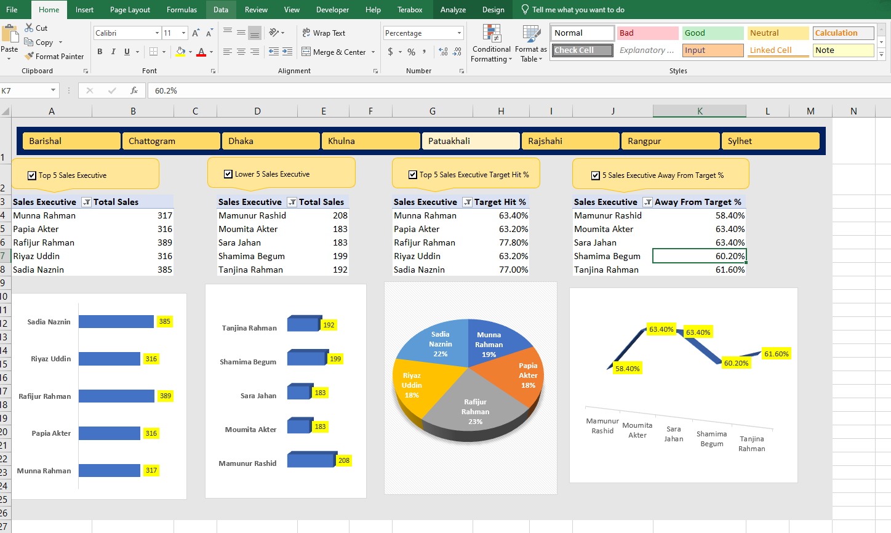

## Project Overview

This Advanced Excel dashboard demonstrates my analytical proficiency by focusing on key sales metrics and performance management.

### Key Insights Visualized:

* **Top/Lower 5 Executives:** Identifies outliers in performance (both positive and negative).
* **Target Hit Analysis:** Tracks achievement against set sales goals.
* **Deviation:** Highlights the variance between actual and target sales.

---

### Dashboard Preview:

*Note: The fully interactive Excel file (.xlsm) is available in the repository.*
